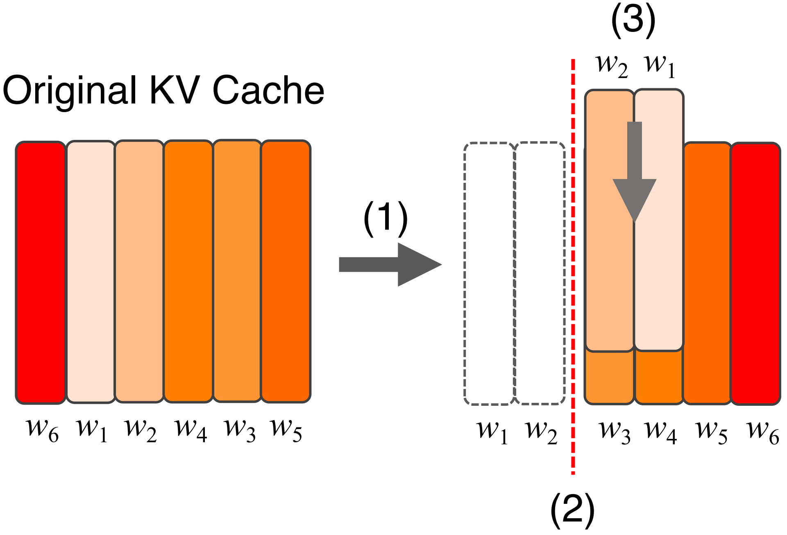

<h1 align="center">Efficient LLMs Inference via Similarity-Aware KV Cache Merging with Bias Calibration</h1>
<p align="center">
Yukai Cheng<sup>1</sup>, Wenxuan Zhou<sup>1</sup>, Zhizhou Li<sup>1</sup>, Zhihao Qu<sup>1</sup>, Baoliu Ye<sup>2</sup><br>
<sup>1</sup>Key Laboratory of Water Big Data Technology of Ministry of Water Resources, Hohai University, China<br>
<sup>2</sup>State Key Laboratory for Novel Software Technology, Nanjing University, China
</p>

---
This repository contains the code for the paper *Efficient LLMs Inference via Similarity-Aware KV Cache Merging with Bias Calibration*.  

<!-- 缩放图片显示 -->
<p align="center">
  
</p>

## Setup
The code runs in the environment specified in the `setup/environment.yml`.
You can create the environment using:

```bash
conda env create -f environment.yml
conda activate simcalkv
```
Another way to create virtual environment:
```bash
python3.10 -m venv simcalkv
source simcalkv/bin/activate

pip install -r requirements.txt
```
Detailed information can be found in `setup`.
## Usage

### Quick Start
`run.txt` contains commands that can be executed locally for testing. **nums_token** refers to the number of tokens in the prefill and decoding phase respectively. The specific value can be set in `llama_eval.py`

Run the inference using the following command. The model path needs to be specified manually, while the dataset, compression ratio and compression method can all be found and selected in the code.
```bash
python llama_eval.py \
    --model_name "meta-llama/Meta-Llama-3.1-8B" \
    --dataset cnn_dailymail \
    --split "test[:100]" \
    --compress_ratio 0.4 \
    --kv_method SimCalKV \
    --output_dir ./llama3.1-8b/results_optimize/nums_token512+64
```
* `--dataset`: Dataset name
* `--split`: Dataset split, e.g. `"validation[:10]"` or `"test[:20]"`
* `--compress_ratio`: Compression ratio
* `--kv_method`: Compression method
* `--output_dir`: Directory to save results

### Evaluation

Summarization (CNN/DailyMail):

```bash
cd task_evaluation
python llama/llama_eval.py --model_name meta-llama/Meta-Llama-3.1-8B --dataset cnn_dailymail --split "test[:100]" --compress_ratio 0.4 --kv_method SimCalKV --output_dir ./qwen2.5-7b/results/nums_token1024+64
```

LongBench (Gov_Report):

```bash
cd task_evaluation
python llama/llama_eval.py --model_name meta-llama/Meta-Llama-3.1-8B --dataset LongBench/gov_report --split "train[:200]" --compress_ratio 0.4 --kv_method PyramidInfer --output_dir ./llama3.1-8b/results/nums_token4096+512
```

### Output

* **CSV**: per-sample results
* **JSON**: summary of memory saving, time, throughput and task metrics

⚡ **Work in progress – under active development.**  
Updates and improvements will be added continuously.
